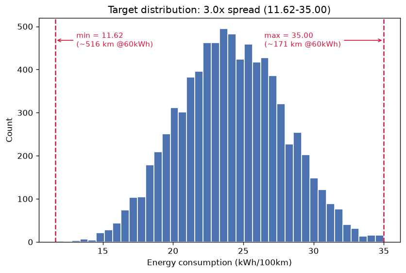
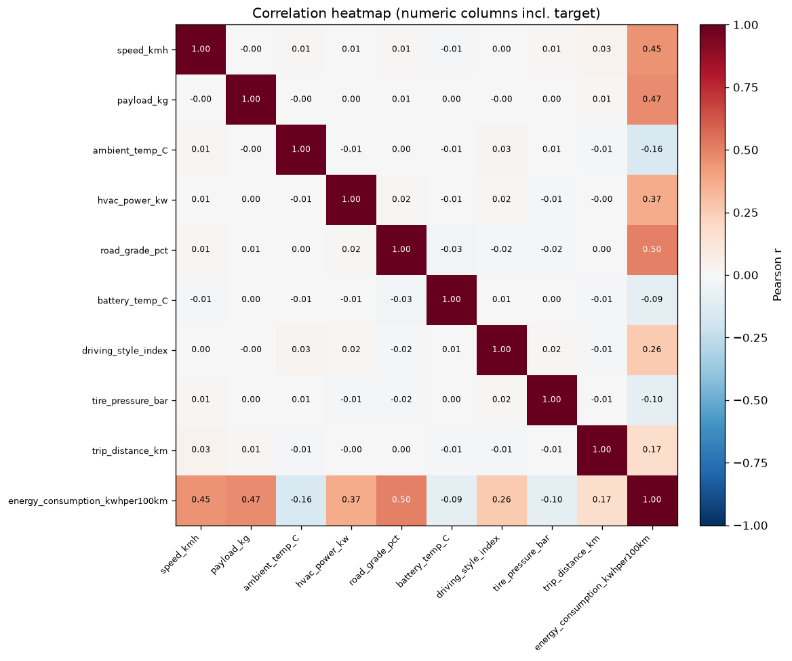
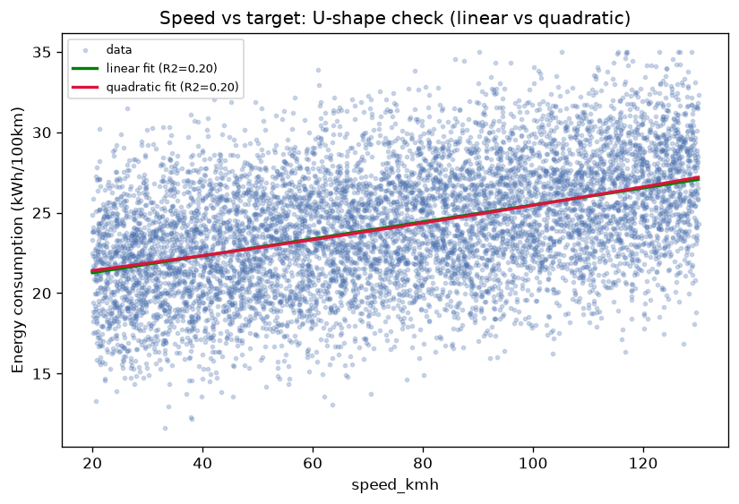
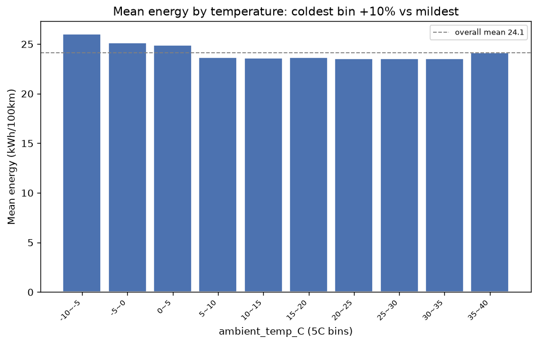
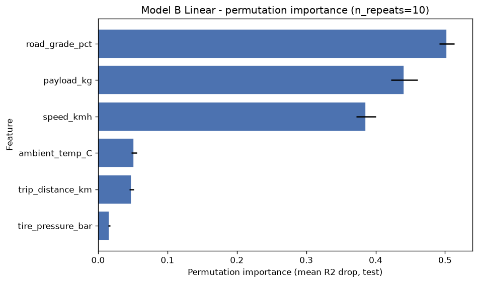
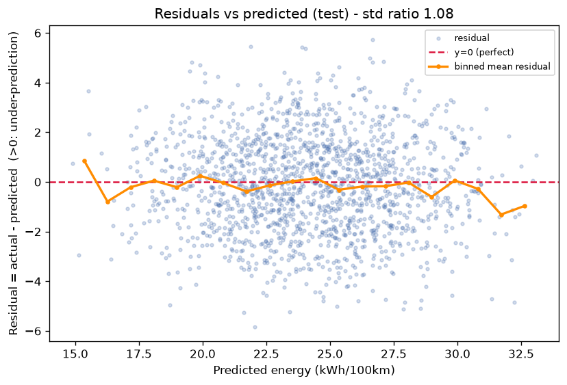

# 전기차 전비 예측 — 최종 보고서

전기차 주행 데이터 **8,000건**으로 구간 전비를 예측하는 회귀 분석의 최종 결과입니다.
데이터를 처음 보는 분도 따라올 수 있도록, 먼저 용어와 요약을 정리한 뒤 세부로 들어갑니다.

---

## 0. 시작하기 전에 — 용어와 30초 요약

**이 보고서를 읽는 데 필요한 용어 5개**

- **전비 (kWh/100km)**: 100km를 달리는 데 쓰는 전기량. 내연차 "연비"의 전기차 버전이되 방향이 반대로, **숫자가 낮을수록 효율적**입니다. 예) 20이면 100km에 20kWh 소모.
- **kWh**: 전기 에너지 단위. "60kWh 배터리"는 가득 채우면 60kWh를 담는다는 뜻.
- **회귀(regression)**: 정답이 연속된 숫자(여기선 전비)인 예측 문제. (범주를 맞히는 분류와 대비)
- **R² / MAE / RMSE**: 예측이 얼마나 정확한지 재는 세 가지 잣대. 자세한 뜻은 6장에 있고, 지금은 **R²는 1에 가까울수록, MAE·RMSE는 0에 가까울수록 좋다**만 알면 됩니다.
- **고정값 안내 (baseline)**: 조건과 무관하게 늘 "전체 평균 전비" 하나로만 답하는 방식. 지금 내비게이션 방식에 가깝고, **우리 모델이 이걸 얼마나 이기는지가 이 프로젝트의 핵심**입니다.

**30초 요약**

- **문제** — 실제 전비는 도로·날씨·짐 무게 등에 따라 **11.6 ~ 35.0 kWh/100km, 약 3배**까지 출렁입니다. 그런데 내비게이션은 카탈로그의 **고정값 하나**로 경로 에너지를 계산해 주행가능거리 안내가 자주 어긋납니다.
- **한 일** — 주행 조건으로 구간 전비를 예측하는 모델을 만들고, "고정값 안내"보다 얼마나 정확한지 측정했습니다.
- **결과** — 조건 기반 예측은 고정값 대비 **오차를 약 47% 줄였습니다** (RMSE 3.68 → 1.94).
- **채택 모델** — 경로를 고르기 전에 알 수 있는 **6개 조건만 쓰는 선형 회귀**. 크기 **1.5KB**로 매우 작고 빠르며, 계수를 그대로 해석할 수 있어 **차량 내비 탑재에 적합**합니다.

---

## 1. 문제 정의

전기차의 실제 구간 전비는 주행·환경 조건에 따라 크게 흔들립니다. 이 데이터에서는 **11.62 ~ 35.00 kWh/100km**로 최대 약 3배 차이가 나고, 60kWh 배터리 기준 주행가능거리로 바꾸면 **171km ~ 516km**의 격차입니다. 그런데 지금의 내비게이션은 카탈로그 공인 전비(단일 고정값)로 경로별 에너지를 계산합니다.

- **왜 필요한가** — 고정 평균값 하나로 안내하면 실제 조건과 어긋나, 주행거리 불안과 불필요한 충전 대기를 낳습니다.
- **무엇을 예측하나** — 주행·환경 조건 → 구간 전비(kWh/100km)를 맞히는 회귀 문제.
- **어디에 쓰나** — 차량 내비게이션의 경로별 에너지 비용 함수(주행가능거리 안내, 충전 계획).
- **누가 쓰나** — 도입 주체는 차량 제조사(OEM), 최종 사용자는 운전자.

> **이 보고서의 핵심 주장:** 카탈로그 공인 전비 하나로 경로를 계산하는 **고정값 안내는 구조적으로 틀립니다.** 아래에서 그 격차를 숫자로 정량화하고, 조건 기반 예측이 오차를 얼마나 줄이는지 실측값으로 답합니다(8장).

---

## 2. 데이터 이해

- **규모/형태** — 8,000행 × 10열의 단일 표. 모든 컬럼이 숫자형이고 그룹 구분 컬럼이 없어, 무작위로 학습/평가를 나눠도 안전합니다.
- **타깃(맞힐 값)** — `energy_consumption_kwhper100km`(연속형). 최소/최대/평균/표준편차 = 11.62 / 35.00 / 24.14 / 3.74.
- **입력 변수 9개** — speed_kmh(속도), payload_kg(적재중량), ambient_temp_C(외기온), hvac_power_kw(공조 전력), road_grade_pct(도로 경사), battery_temp_C(배터리 온도), driving_style_index(운전 성향), tire_pressure_bar(타이어 공기압), trip_distance_km(주행거리).
- **품질** — 결측 0건, 중복행 0건, 물리적으로 불가능한 값 0건(음수 속도·거리·전비, 타이어 압력 0, 배터리 온도 −40 미만 모두 없음). 별도 정제가 필요 없습니다.

### 왜 모델을 A와 B 둘로 나눴나

경로를 **고르기 전에** 그 값을 알 수 있느냐를 기준으로 변수를 두 묶음으로 나눕니다.

| 구분 | 쓰는 변수 | 용도 |
|---|---|---|
| **Model A** (9변수, 참고용) | 위 9개 전부 | 성능의 상한선과 변수 중요도를 파악 |
| **Model B** (6변수, **주력·탑재 후보**) | trip_distance_km, road_grade_pct, speed_kmh, ambient_temp_C, payload_kg, tire_pressure_bar | 경로 계획 시점에 확보 가능한 신호(HD맵 고도, 타이어 공기압 센서 등)만 사용 |

`hvac_power_kw`·`battery_temp_C`·`driving_style_index` 세 변수는 **실제로 달려봐야 알 수 있는 값**이라 Model B에서 뺐습니다. 이걸 입력에 넣으면 "주행이 끝난 뒤에야 설명되는" 모델이 되어 내비게이션에 쓸 수 없습니다. Model B에서는 `ambient_temp_C`(외기온)가 공조 부하를 대신 설명하는 역할을 합니다. A와 B의 성능 차이가 곧 **그 3개 변수를 따로 추정해서 얻을 수 있는 이득의 크기**입니다(9장).

---

## 3. 데이터 살펴보기(EDA) — 핵심 결과 4가지


**① 전비는 넓게 퍼져 있다.** 11.62~35.00으로 약 3배(60kWh 기준 주행거리 171~516km) → 고정 평균값(24.1) 하나로 안내하는 현재 방식은 구조적으로 틀립니다.


**② 전비를 가장 강하게 끌어올리는 변수는 경사·무게·속도다.** road_grade_pct(상관계수 r=+0.50) > payload_kg(+0.47) > speed_kmh(+0.45) 순. 변수끼리 완전히 겹치는 쌍이 없어, 서로 정보가 중복돼 계수가 뒤틀릴 위험(다중공선성)은 낮습니다.


**③ 속도-전비 관계는 거의 직선이다.** 곡선으로 봐도 이득이 미미(2차항 계수 +0.00007, R² 0.20→0.20) → 굳이 곡선항을 넣지 않아도 선형 가정으로 충분합니다.


**④ 추울수록 전비가 나빠진다.** 최저온 구간(−10~−5°C) 평균 전비 26.0이 고온 구간(30~35°C, 23.5)보다 +10% 높음 → 저온 난방 부하가 전비를 크게 끌어올립니다(외기온이 공조 부하의 대리 지표).

> 참고: `trip_distance_km`(주행거리)는 전비와 r=0.17로 사실상 무관합니다. 타깃이 이미 "100km당" 값으로 정규화돼 있어, 거리 자체가 구간 전비를 거의 결정하지 않는 자연스러운 결과입니다.

---

## 4. 전처리 전략

- **이상치** — 물리적으로 불가능한 값이 0건이라, 상식 범위 필터만 적용하고 실제 **제거한 행은 0건**입니다.
- **스케일링(단위 맞추기)** — 변수마다 값의 범위가 최대 625배까지 차이 납니다(예: payload_kg vs tire_pressure_bar). 선형 모델의 계수가 단위 때문에 왜곡되지 않도록 모든 변수에 공통으로 표준화(StandardScaler)를 적용합니다. 트리 계열 모델은 단위에 영향받지 않아 적용하지 않습니다.
- **정보 누수(leakage) 차단** — 표준화 기준은 **학습 데이터에서만** 계산하고 평가 데이터엔 그대로 적용합니다. 이 과정을 파이프라인으로 묶어, 평가 데이터의 정보가 학습에 새어들어가 성능이 부풀려지는 일을 원천 차단합니다.
- **파생변수 3개(물리 근거)** — `hvac_kwh_per_100km`, `grade_load = payload_kg × road_grade_pct`, `speed_sq = speed_kmh²`. (Model B는 grade_load, speed_sq 2개만.)

> **정직한 기록:** 물리 근거로 파생변수를 만들어 봤지만 선형 모델의 성능 개선은 사실상 **0**이었습니다(학습 교차검증 R² 기준 Model A 0.9282→0.9282, Model B 0.7251→0.7252, 둘 다 Δ +0.0001). "이 데이터는 원본 변수의 선형 조합만으로 이미 충분히 설명된다"는 뜻입니다. 파생변수는 채택하되, 성능 자랑이 아니라 **"선형으로 충분하다"는 증거**로 남깁니다.

---

## 5. 모델링 설계

- **비교한 모델(3계열)** — ① **고정값(DummyRegressor)**: 늘 평균만 답하는 비교 기준선 → ② **선형 회귀(LinearRegression)**: 원본/파생 → ③ **랜덤 포레스트(RandomForest)**: 기본과 튜닝. "선형으로 충분한가, 아니면 비선형이 더 나은가"를 판정하기 위한 최소 구성입니다.
- **검증 방법** — 전체의 20%를 평가용으로 떼어 **맨 마지막에 딱 한 번만** 측정합니다. 모델 선택은 학습 데이터 내부를 5조각으로 나눠 돌려보는 교차검증(5-fold, 타깃 5분위 기준)으로 하고, 최종 보고 숫자만 평가 데이터로 냅니다. 모든 전처리는 앞서 말한 대로 학습 데이터에서만 기준을 잡습니다.
- **선정 원칙** — 정확도 1등을 기계적으로 고르지 않습니다. 차량 탑재 제약(모델 크기, 추론 속도, 계수 해석 가능성)을 정확도와 **함께** 봅니다.

---

## 6. 평가 결과와 모델 선정

먼저 세 잣대의 뜻:

- **R²(설명력)** — 전비의 출렁임을 모델이 몇 %나 설명하는가. 1이면 완벽, 0이면 "그냥 평균 찍기" 수준.
- **MAE(전형적 오차)** — 예측이 평균 몇 kWh 빗나가는가. 작을수록 좋음.
- **RMSE(큰 오차에 민감)** — 크게 틀린 예측에 더 큰 벌점을 주는 오차. 업무 환산(8장)의 기준으로 씁니다.

전체 비교(평가 데이터, 최종 1회 측정):

| 모델 | 변수셋 | CV R² | test R² | test MAE | test RMSE | 추론시간(ms/1000건) | 모델크기(KB) |
|---|---|---|---|---|---|---|---|
| Dummy(mean) | A | -0.0001 | -0.0013 | 2.993 | 3.6786 | 0.023 | 0.9 |
| Linear(원본) | A | 0.9282 | 0.9246 | 0.8107 | 1.0093 | 0.339 | 1.7 |
| Linear(파생) | A | 0.9282 | 0.9245 | 0.812 | 1.0099 | 0.646 | 2.5 |
| RF(기본) | A | 0.8917 | 0.8975 | 0.9294 | 1.1767 | 13.912 | 56851.1 |
| RF(튜닝) | A | 0.8935 | 0.8996 | 0.9184 | 1.1651 | 48.584 | 170637.4 |
| **Dummy(mean)** | **B** | -0.0001 | -0.0013 | 2.993 | 3.6786 | 0.017 | 0.8 |
| **Linear(원본)** ★ | **B** | **0.7251** | **0.7207** | **1.5783** | **1.9427** | **0.285** | **1.5** |
| Linear(파생) | B | 0.7252 | 0.7207 | 1.5788 | 1.9427 | 0.582 | 2.2 |
| RF(기본) | B | 0.7163 | 0.7136 | 1.5895 | 1.9675 | 15.252 | 56873.2 |
| RF(튜닝) | B | 0.7215 | 0.7231 | 1.5643 | 1.9344 | 23.882 | 20387.4 |

읽는 법:

- **고정값(Dummy)은 test R²=−0.0013 ≈ 0** → 평균값 안내는 조건을 **전혀 설명하지 못합니다**("구조적으로 틀리다"의 숫자 증거).
- **Model B 선형(원본)은 R²=0.7207** → 전비 출렁임의 약 72%를 설명. 전형 오차(MAE)는 1.5783 kWh/100km입니다.

### 최종 선정 = Model B 선형 회귀(원본 변수)

가장 정확한 건 Model B RF(튜닝)로 test R²=0.7231이지만, 선형(0.7207)과의 차이는 **ΔR²≈0.002로 사실상 무의미**합니다(비선형으로 더 짜낼 여지가 없음). 반면 탑재 제약에서는 격차가 결정적입니다.

| 관점 | Model B 선형(원본) | Model B RF(튜닝) | 차이 |
|---|---|---|---|
| 모델 크기 | 1.5 KB | 20,387.4 KB | 약 **13,600배** 작음 |
| 추론 시간 | 0.285 ms/1000건 | 23.882 ms/1000건 | 약 **84배** 빠름 |
| 해석성 | 계수 = 물리 해석 | 블랙박스 | — |

→ 정확도 손실이 없다시피 한데 크기·속도·해석성이 압도적이므로, **차량 탑재에는 선형이 최적**입니다. 랜덤 포레스트는 "선형으로 충분함"을 확인시켜 주는 대조군으로만 남깁니다(정확도 1등 ≠ 채택). Model A(선형 원본 test R²=0.9246)는 미래에 확보할 3개 변수까지 넣었을 때의 **성능 상한 참고치**이며, 지금 탑재 후보는 아닙니다.

---

## 7. 이 모델은 왜 이렇게 예측하나 (오차 해석)

최종 모델(Model B 선형, test R²=0.7207)을 두 가지로 해석합니다: 변수 중요도와 잔차(예측이 빗나간 방향).



| 변수 | 중요도 | 계수 | 물리적 의미 |
|---|---|---|---|
| road_grade_pct | 0.5029 | +1.860 | 오르막의 위치에너지 부하 ↑ → 전비 ↑ |
| payload_kg | 0.4412 | +1.750 | 적재중량(관성·구름저항) ↑ → 전비 ↑ |
| speed_kmh | 0.3860 | +1.660 | 속도(공기저항) ↑ → 전비 ↑ |
| ambient_temp_C | 0.0517 | -0.604 | 외기온 ↑ → 난방 부하 ↓ → 전비 ↓ |
| trip_distance_km | 0.0480 | +0.547 | 100km당 정규화값이라 기여 미미 |

*중요도는 그 변수를 무작위로 섞었을 때 성능(R²)이 얼마나 떨어지는지로 측정합니다(값이 클수록 중요).* 계수의 부호와 크기가 모두 물리 상식과 일치합니다 → **계수 자체가 곧 설명**이라는 점이 선형 모델을 택한 부가 이점입니다.



- **오차의 크기는 대체로 고르다** — 예측값 구간별로 잔차의 퍼짐 정도 차이가 1.08배에 그칩니다.
- **다만 방향이 한쪽으로 치우친다** — 잔차 = 실제 − 예측이므로, 값이 양수면 실제보다 낮게 예측한 것(과소예측)입니다.

| 전비 구간 | 평균 잔차 | 과소예측 비율 |
|---|---|---|
| 하위 25% | -1.330 | 23.2% |
| 중위 50% | -0.162 | 46.3% |
| **상위 25%(고전비)** | **+1.139** | **75.1%** |

> **소견·제언:** 전비가 높은 경로(상위 25%)에서 평균 +1.139 kWh/100km만큼 **낮게 예측(과소예측 75.1%)**하는 경향이 있습니다. 실제보다 낮게 안내하면 도로 한복판 방전 위험을 키웁니다. 고전비 예측에는 **안전 여유분**을 더하거나 **분위 회귀(quantile regression)**로 보수적으로 보정할 것을 권합니다.

---

## 8. 업무로 환산하면 (얼마를 아끼나)

오차 RMSE(1.9427 kWh/100km)를 실무 단위로 바꿉니다. 가정: 경로 200km, 배터리 60kWh, 충전 단가 300원/kWh.

| 지표 (200km 경로) | 값 | 계산 |
|---|---|---|
| 에너지 오차 | **3.89 kWh** | RMSE × 2 |
| 도착 SOC 오차 | **6.48 %p** | 에너지오차 / 60 × 100 |
| 요금 오차 | **1,166 원** | 에너지오차 × 300 |

### 고정값 대비 개선율 (이 프로젝트의 1순위 성공 기준)

| 지표 | 고정값(Dummy) | 최종 모델(Model B 선형) | 개선율 |
|---|---|---|---|
| RMSE | 3.6786 | 1.9427 | **47.2%** |
| MAE | 2.9930 | 1.5783 | **47.3%** |

> **1장의 주장에 대한 답:** 고정값(전체 평균 전비) 안내는 구조적으로 틀리며, 조건 기반 예측(Model B 선형)은 그 오차를 **약 47% 줄입니다.**

### 주행가능거리 격차 재현

| 조건 | 예측 전비(kWh/100km) | 주행가능거리(60kWh) |
|---|---|---|
| 가장 효율적 | 14.90 | 403 km |
| 가장 비효율 | 33.08 | 181 km |
| **격차** | — | **221 km** |

카탈로그 단일값 안내는 이 **221km 격차**를 통째로 무시합니다(1장의 이론 격차 171~516km를 최종 모델의 실제 예측 범위로 재현한 값).

---

## 9. 한계와 앞으로

1. **데이터가 수식 기반 합성일 가능성** — 비선형 모델(RF)이 선형 모델을 이기지 못했고, 변수 대부분이 균등분포에 가까우며 완전상관 쌍도 없습니다. 물리 수식으로 만든 인위적 데이터일 개연성이 높습니다. 따라서 "선형으로 충분"이라는 결론은 이 합성 특성에 기댄 것일 수 있고, 실제 운행 데이터에서는 비선형·상호작용이 더 클 수 있습니다.
2. **미래 변수 3개를 뺀 대가** — 공조 전력·배터리 온도·운전 성향을 제외해 성능 상한을 낮췄습니다. **Model A(9변수) test R²=0.9246 vs Model B(6변수) 0.7207**, 이 격차(≈0.20)가 그 3개 변수를 별도로 추정해 얻을 수 있는 이득의 크기입니다. 향후 공조·운전습관 추정 모듈을 붙이면 회수할 수 있습니다.
3. **데이터에 아예 없는 변수** — 차종, 배터리 열화(SOH), 계절, 회생제동 등은 실제 전비를 크게 좌우하지만 이 데이터엔 없습니다. 그만큼을 무시한 예측입니다.
4. **교육용 데이터 ↔ 실차 데이터의 간극** — 이 결과는 잘 정제된 8,000건 기준입니다. 노이즈·결측·센서 오차가 많은 실차 데이터에서는 성능과 오차 구조가 달라질 수 있어, 배포 전 실차 데이터로 재검증이 필요합니다.

---

## 부록 A. 이 저장소로 앱 실행하기

경로 계획 시점에 확보 가능한 6개 조건만으로 구간 전비를 예측하는 Streamlit 데모 앱이 포함돼 있습니다.

```bash
pip install -r requirements.txt
streamlit run app.py
```

- **예측 탭** — 6개 조건 슬라이더 → 예측 전비와 업무 지표(에너지·요금·도착 SOC·주행가능거리), 그리고 고정값 대비 개선.
- **리포트/해석 탭** — 위 3·7장의 그림과 변수 중요도 표.

예측·업무환산 로직은 `serve/predict.py` 한 곳에만 있고(단일 출처), 앱은 이를 호출만 합니다.
